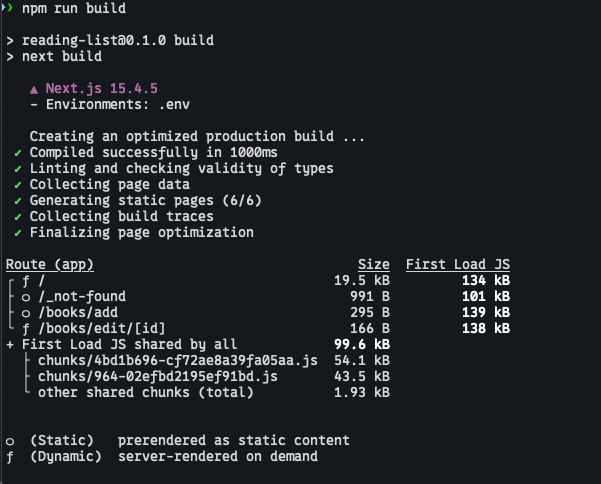
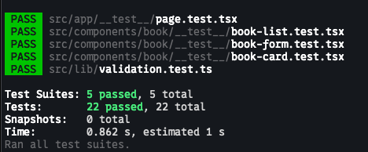

# Reading List Application

This is a simple web application for managing a reading list, built with Next.js, React, Prisma, and Tailwind CSS.

## Project Setup

To set up the project locally, follow these steps:

1.  **Clone the repository:**

    ```bash
    git clone <repository-url>
    cd reading-list-web
    ```

2.  **Install dependencies:**

    ```bash
    npm install
    ```

3.  **Set up the database:**

    This project uses Prisma for database management. Run the following command to apply migrations and set up your local database:

    ```bash
    npx prisma migrate dev
    ```

## Features

This application provides the following features:

*   **Book Management:**
    *   Add new books to your reading list.
    *   Edit details of existing books.
    *   View a list of all books in your collection.
    *   Search for books within your reading list.
    *   Confirm dialog before deleting a book.
    *   Form validation to ensure book data is correctly entered before submission.
*   **Database Integration:** Utilizes Prisma for efficient database management.
*   **Comprehensive Testing:** Includes unit and integration tests to ensure reliability and functionality.

## Running the Application

To run the application in development mode:

```bash
npm run dev
```

This will start the development server, usually accessible at `http://localhost:3000`.

To build the application for production:

```bash
npm run build
```

To start the production server:

```bash
npm run start
```

## Running Tests

To run the tests:

```bash
npm run test
```

## Linting

To run the linter:

```bash
npm run lint
```

## Showcase

### Build Success



### Test Passed



### Desktop ( WEB ) Demo

[▶️ Watch Desktop Mode Demo](docs/dekstop-mode.mov)

### Mobile Demo

[▶️ Watch Mobile App Demo](docs/mobile-mode.MP4)

## Trade-offs and Future Improvements

With more time, the following areas could be improved:

-   **Pagination/Infinite Scrolling:** For a large reading list, implement pagination or infinite scrolling to improve performance and user experience.
-   **User Authentication:** Implement user authentication to allow multiple users to manage their own reading lists.
-   **Image Uploads:** Instead of just storing a URL for the book cover, implement actual image uploads and storage (e.g., using a cloud storage service like AWS S3).

### Made with ❤️ and 🎵 by Pasquale Palena